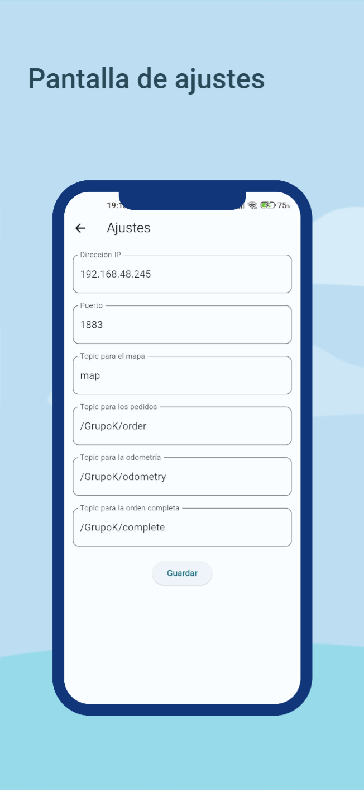
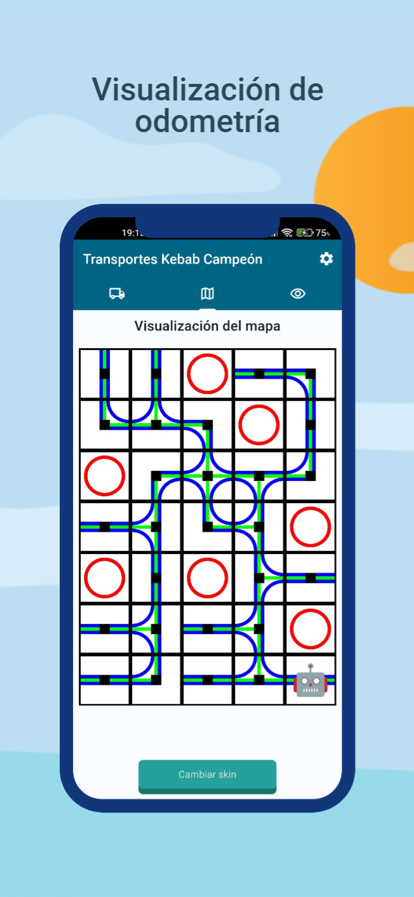
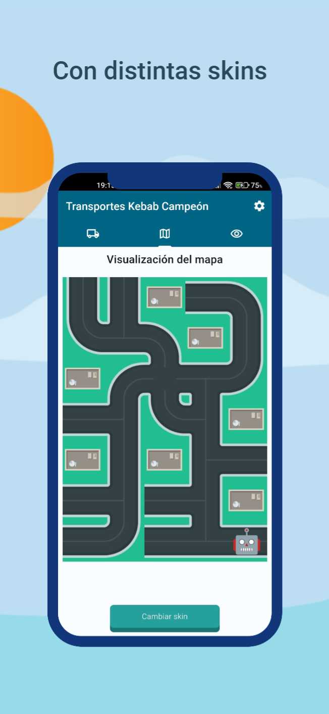
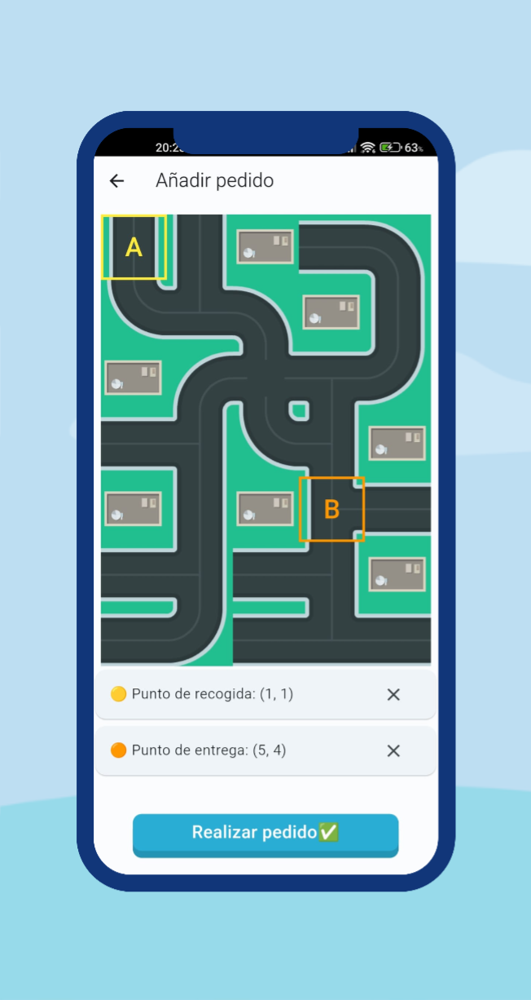
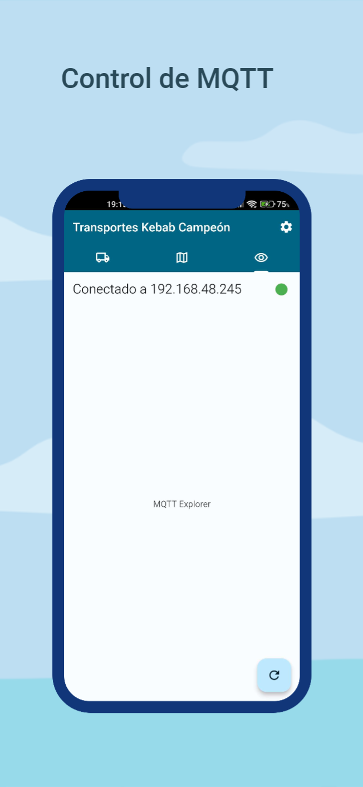

# App Lego Mindstorm
## Introducción

Esta aplicación ha sido desarrollada para la asignatura de Inteligencia Ambiental de Ingeniería Informática UJA. El objetivo era desarrollar una aplicación para controlar la funcionalidad de un proyecto dónde se buscaba programar un robot LEGO Mindstorms EV3 para que dentro de un mapa realizase recogida y entrega de pedidos de forma autónoma, controlando la comunicación mediante MQTT .Las funcionalidades que ofrece son las siguientes:

- Conexión a un broker MQTT, permitiendo cambiar parámetros de conexión.
- Recibir el mapa desde un servidor  que realiza un envío periódico del mapa dónde se desarrolla la actividad del robot.
- Seleccionar los puntos de recogida y entrega del paquete respecto al mapa actual.
- Realizar pedidos al robot, publicando el pedido correspondiente en un topic al que el robot estaba suscrito.
- Consultar y visualizar la odometría del robot mediante la suscripción a un topic dónde este publica su localización en el mapa de forma continúa.

## ⚙ Instalación
La aplicación está desarrollada en Flutter, por lo que podría compilarse para Android, IOS, web, Windows, MacOS y Linux.

### Instalación Android
Tan solo hay que **descargar el APK** clickando en la siguiente imagen:

#### Pasos para la instalación
- Descargar el apk
- Activar [fuentes externas](https://www.lavanguardia.com/andro4all/google/activar-fuentes-desconocidas-android-instalar-aplicaciones) en el dispositivo
- Instalar el apk

Una vez instalada, se debe ir a los ajustes y configurar los parámetros para la conexión con el servidor MQTT. Una vez guardados los ajustes, la app estaría lista para ser usada.

  
      

  

### Otras plataformas
Para la instalación en otras plataformas se deberán tener unos requisitos previos:

- Sistema MacOS y XCode para el caso de IOS y MacOS.
- Android Studio
- Flutter

Una vez cumplidos los requisitos, se deberá descargar el .zip de este proyecto de GitHub, abrirlo en Android Studio y compilar la aplicación para la plataforma requerida.

## 📌 Funcionalidades
- **Lista de pedidos en cola, en curso y finalizados**  
  En esta pantalla se visualizarán todos los pedidos que se hayan registrado en la aplicación, clasificándolos entre pedidos en cola, en curso y finalizados. Permitiendo eliminar cada uno de ellos y añadir nuevos pedidos con el botón de la parte inferior.

  
      

  

- **Mapa con la posición del robot a tiempo real**  
  En esta pantalla se visualizará la odometría recibida por el robot, actualizándose en tiempo real en función de la información recibida.

  
      
      

  

- **Mapa para seleccionar el punto de recogida y entrega**

  
      

  

- **Pantalla para comprobar la conexión con el servidor**

  
      

