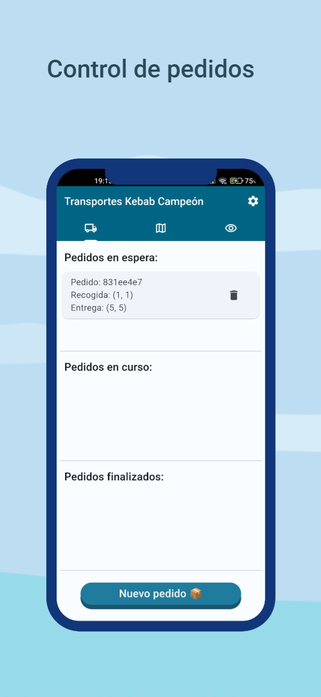

# App Lego Mindstorm
## Introducción

Esta aplicación ha sido desarrollada para la asignatura de Inteligencia Ambiental de Ingeniería Informática UJA. Las funcionalidades que ofrece son las siguientes:

- Recibir el mapa desde un broker MQTT
- Seleccionar los puntos de recogida y entrega del paquete
- Poner pedidos en cola
- Consultar odometría del robot

## ⚙ Instalación⚙
La aplicación está disponible para Android e iOS. 

### Instalación Android
#### Apk

#### Pasos para la instalación
- Descargar el apk
- Activar [fuentes externas](https://www.lavanguardia.com/andro4all/google/activar-fuentes-desconocidas-android-instalar-aplicaciones) en el dispositivo
- Instalar el apk

Una vez instalada, se debe ir a los ajustes y configurar los parámetros para la conexión con el servidor MQTT.

    

Una vez guardados los ajustes, la app estaría lista para ser usada.

### iOS
Para la instalación en iOS se deberán tener unos requisitos previos:

- Sistema MacOS
- Android Studio
- XCode con la plataforma iOS 17.4
- Flutter

Una vez cumplidos los requisitos, se deberá descargar el .zip de este proyecto de GitHub, abrirlo en Android Studio, conectar el dispositivo iOS al ordenador y ejecutar la aplicación en dicho dispositivo.

### Funcionalidades
- **Lista de pedidos en cola, en curso y finalizados**

    

- **Mapa con la posición del robot a tiempo real**

    
    

- **Mapa para seleccionar el punto de recogida y entrega**

    

- **Pantalla para comprobar la conexión con el servidor**

    

